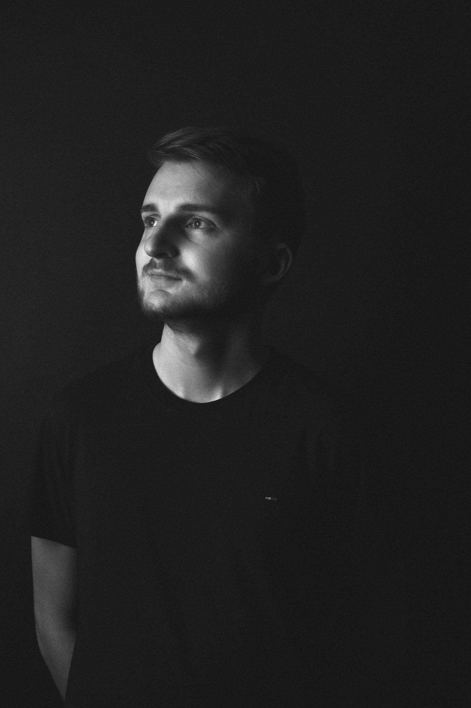
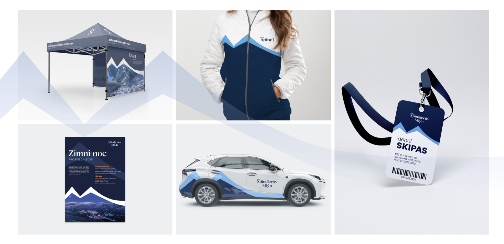
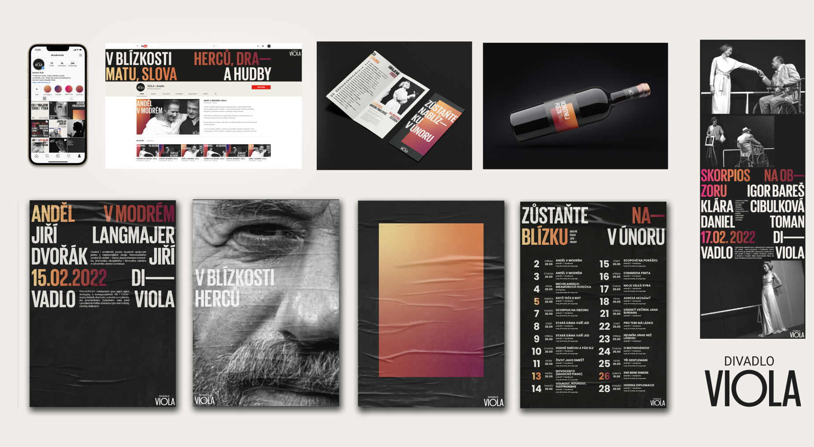
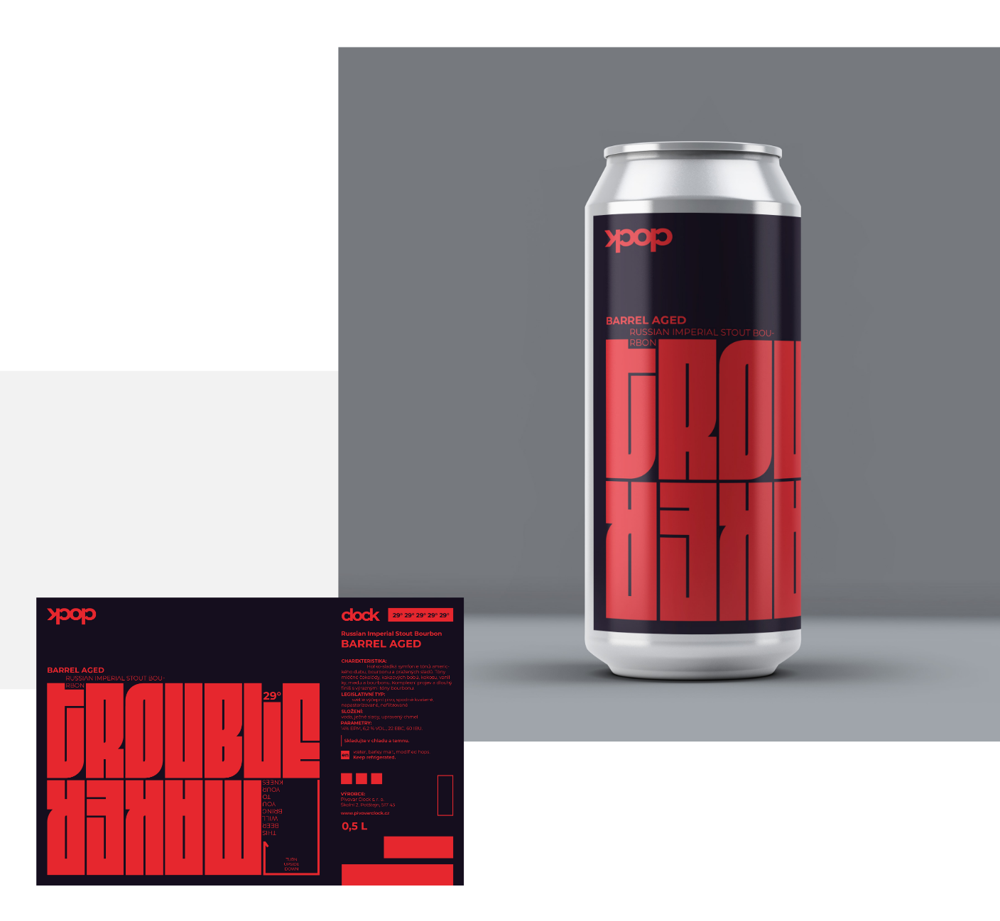

<h1>I'm Jan Jiracek</h1>

I am currently working as a junior graphic designer in Wextra communications and at the same time I am studying at a creative university, graphic and media design specialization.

I first encountered graphic design in high school, where I studied economics and accounting. It was there I discovered for the first time that I enjoy creative work connected to design. It doesn’t make a lot of sense, but we had a subject there that was about graphic design and I really excelled in it.

I also enjoy playing the flute, dancing and playing computer games. 

The most important thing for me is humility  towards more experienced people, always friendly mood and do what you makes happy.

<h2>My 3 top works</h2>
<h3>Špindlerův Mlýn</h3>

Špindlerův Mlýn certainly the most popular ski and leisure resort in the Czech Republic. It offers high quality hotels for relaxing or skiing and even in summer offers lots of activities as cycling, mountaineering and so long.

The resort of course wants to maintain its current position, it decided to redesign its logo and connect the city hotel part with the ski part. (for now they are seperated – different logos…) 

 
<h3>Theatre Viola</h3>

A school project for a real client, the Viola Theater, who asked us for a complete redesign of their existing materials, logo and communication. The goal was to modernize the graphic design and point out the uniqueness of the theater, which is based on a very small hall, where the audience is close to the actors.

     
 <h3>Craftbeer design</h3>

I ask a client called Clock if I could make a design for craftbeer they are creating.
The beer is very strong so I chose a monumental typography with a very aggressive red color to represent the power of that beer. Its still in progress but the Beer will look similar to this example.

