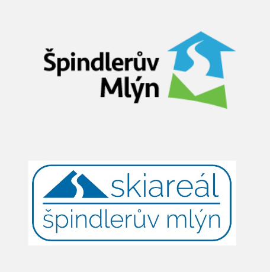
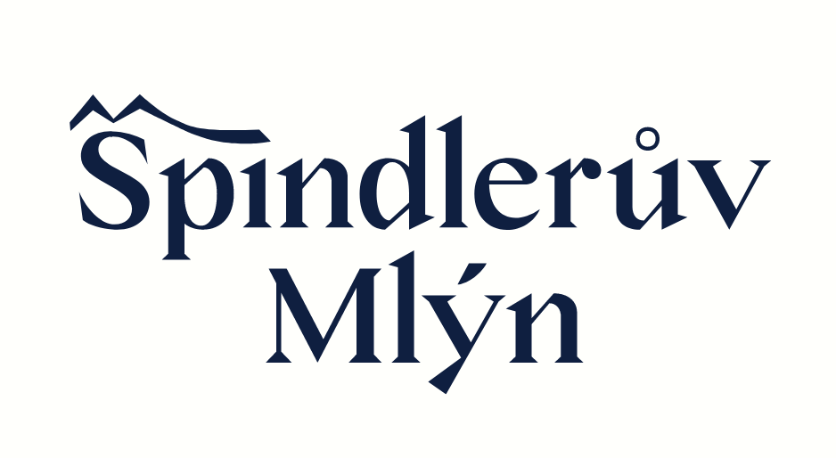

<html>
<u> <b>CASE STUDY</b> </u>
  <h1>LOGO REDESIGN – ŠPINDLERŮV MLÝN</h1>

  <b>short description</b>    Modernize current logo of ski and leisure resort called Špindlerův Mlýn including mini example of visual identity.
  
  <b>CONTEXT</b>
  
  Špindlerův Mlýn certainly the most popular ski and leisure resort in the Czech Republic. It offers high quality hotels for relaxing or skiing and even in summer offers lots of activities as cycling, mountaineering and so long.

The resort of course wants to maintain its current position, it decided to redesign its logo and connect the city hotel part with the ski part. (for now they are seperated – different logos…) 

  
<b>Role</b> – Graphic lead (logo, design application)

  <b>Team</b> – 2 graphic designers
big thanks for my collaborator Anička Vokounová
  
   <b>Duration</b> – 6 months
  
   <b>Status</b> – Waiting for client (classic)
  
  <h2>Problem</h2>
  
The problem was not only to come up with a new logo for the center. The problem was to unite the two logos together that you see on the left. So it was a connection of two factors. The first factor was relaxation, representing the hotel part, and the second factor was action/sport, which represented the ski area part.

    
  
  
        The old logos look very substandard and old. They do not reflect the quality of the services of these two entities at all.
  
  <h2>Solution</h2>
  
I followed two main factors to create the new logo. In addition, I added a third characterizing factor. This was the historical legacy and tradition of the resort, which is reflected in the typography.

  
   
  
   <h2>Result</h2>
  
This is the result of our project. As you can see, we work with the line on all possible corporate materials and thanks to it we have created a comprehensive visual identity.
    
    We learnt from this project lot of thing, like typography, communication woth clients and use 

The client chose this project as the best..

  
   
  
  
  </html>
